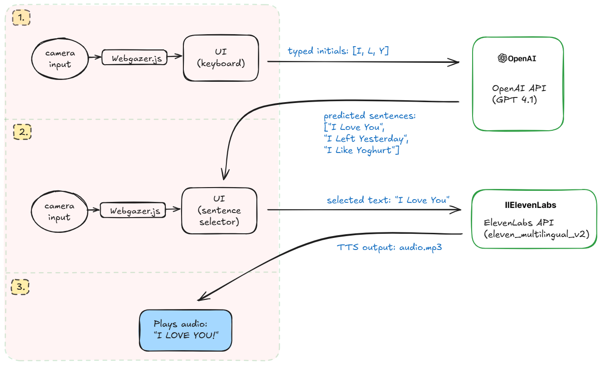

## Eye Speak

Gaze-controlled on-screen keyboard with LLM-powered sentence suggestions and text-to-speech.

### Architecture Overview


_System architecture diagram showing the interaction between components_

### Features

- Eye tracking in the browser via WebGazer
- Smart sentence suggestions from initials using OpenAI
- Text-to-Speech via ElevenLabs
- Simple Express server with REST endpoints

### Quick start

Prerequisites: Node.js 18+ and npm

```bash
npm install

# Copy env example and set your keys
cp config/.env.example .env
# then edit .env and fill values for the keys below

# Run the server
npm start
# Open http://localhost:3000
```

Environment variables (read from `./.env` or `./config/.env`):

- `OPENAI_API_KEY` (required): OpenAI API key for suggestions
- `ELEVENLABS_API_KEY` (required): ElevenLabs API key for TTS
- `PORT` (optional, default 3000): Server port

### Using the app

1. Open the app in your browser.
2. Click "Calibrate" and follow the on-screen dots.
3. Click "Start Tracking". Adjust dwell time if needed.
4. Dwell on keys to type. Suggestions can be fetched from initials.
5. Use TTS to speak out the typed text.

### REST API

Base URL: `http://localhost:3000`

- GET `/api/health`

  - Returns `{ ok: true }` when the server is up.

- POST `/api/suggest`

  - Body: `{ "initials": ["I","L","Y"], "k": 5 }`
  - Response: `{ "initials": ["I","L","Y"], "results": [{ "text": "I love you", "score": 0.87 }, ...] }`
  - Notes: Default model is `gpt-4.1`. See `llm/suggest.js` to adjust.

- POST `/api/tts`
  - Body: `{ "text": "I love you" }`
  - Response: MP3 binary (`Content-Type: audio/mpeg`).

### Project structure

```
eye-speak/
├─ assets/
│  └─ diagram2.png      # System architecture diagram
├─ public/
│  ├─ index.html       # Frontend entry (loads WebGazer and app.js)
│  ├─ app.js           # Gaze keyboard logic and UI
│  └─ style.css        # Styles
├─ llm/
│  └─ suggest.js       # OpenAI-backed sentence suggestions
├─ tts/
│  └─ elevenlabs.js    # ElevenLabs TTS client
├─ server.js           # Express server + API routes
├─ config/
│  └─ .env.example     # Sample env file (copy to .env)
├─ package.json
├─ README.md
└─ LICENSE
```

### Development notes

- The server uses ES modules (`"type": "module"`).
- Suggestions require a valid `OPENAI_API_KEY` or the endpoint will return a 400 error.
- TTS requires a valid `ELEVENLABS_API_KEY` or the endpoint will return a 400 error.
- WebGazer runs entirely in the browser; no webcam video is sent to the server by default.

### Troubleshooting

- Suggestion errors (400 suggest failed): ensure `OPENAI_API_KEY` is set and valid.
- TTS errors (400 tts failed): ensure `ELEVENLABS_API_KEY` is set and valid.
- Module import issues: use Node 18+ and keep `"type": "module"` in `package.json`.

### Acknowledgements

- WebGazer.js for eye tracking
- OpenAI API for language suggestions
- ElevenLabs for text-to-speech
